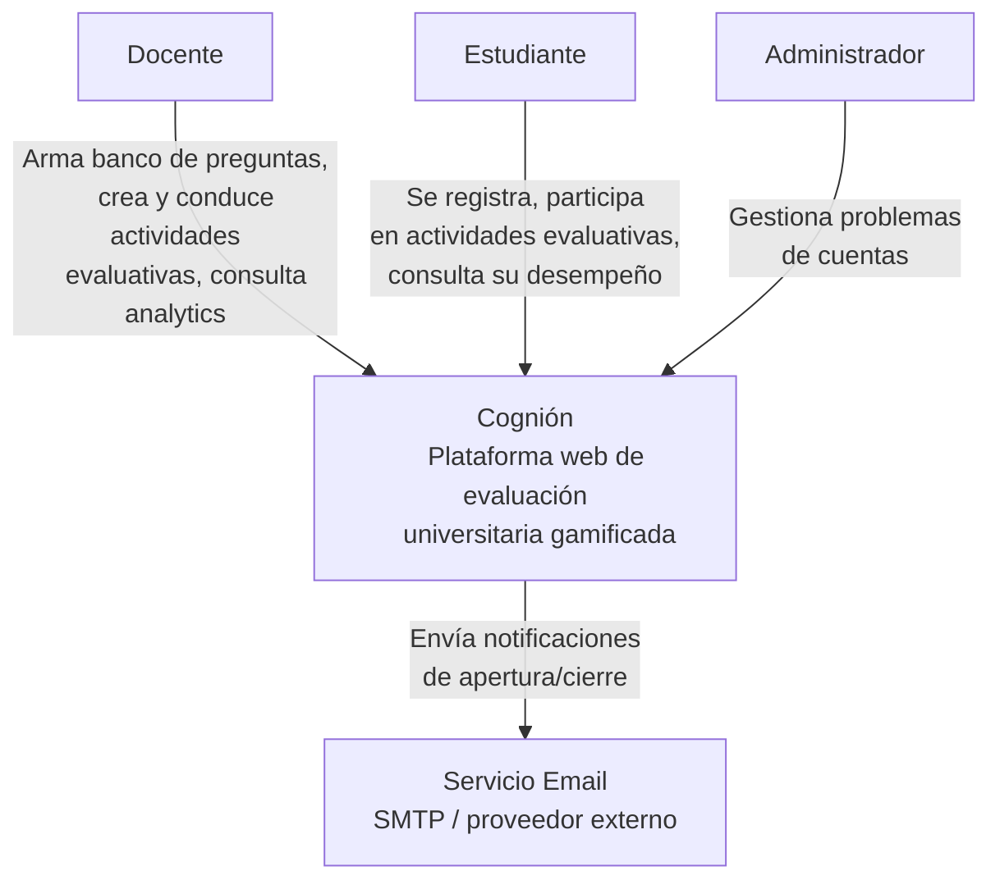

# 01 System Context

## Propósito

Describir la vista de más alto nivel de Cognión: qué problema resuelve, quiénes interactúan con
el sistema y con qué servicios externos se integra.

Este documento fija el **límite del sistema** y sirve como punto de entrada para las vistas
arquitectónicas de menor nivel.

## Alcance

Incluye:

- actores principales;
- sistema bajo diseño;
- sistemas externos relevantes;
- relaciones de alto nivel entre esos elementos.

No incluye la descomposición interna en contenedores ni Bounded Contexts.

## Fuentes

- `docs/requirements/vision.md`
- `docs/rf/ARQ_v1.md`
- `docs/adr/ADR-006-integracion-directa-sesiones-notificaciones.md`
- `docs/adr/ADR-015-renombrar-bc-sesiones-actividad-evaluativa.md`

## Descripción

Cognión es una plataforma web de evaluación universitaria basada en cuestionarios
gamificados. Soporta dos modalidades de actividad evaluativa — período abierto y en vivo
(estilo Kahoot!) — sobre un banco de preguntas clasificado, con seguimiento histórico del
desempeño individual y grupal.

Desde la perspectiva de contexto, Cognión se comporta como un único sistema que:

- permite al docente armar el banco de preguntas, crear y conducir actividades evaluativas, y
  consultar analytics;
- permite al estudiante registrarse por invitación, participar en actividades evaluativas y
  consultar su propio desempeño;
- permite al administrador resolver problemas de cuentas de usuario;
- delega el envío de notificaciones por email a un proveedor externo.

## Actores

### Docente

Arma y mantiene el banco de preguntas, crea y conduce actividades evaluativas en ambas
modalidades, y accede a analytics y KPIs de desempeño. Es el único docente del sistema en v1.

### Estudiante

Se registra vía link de invitación, participa en actividades evaluativas de período abierto y
en vivo, y consulta su propio historial de desempeño.

### Administrador

Gestiona problemas de cuentas de usuario (bloqueos, recuperación) sin depender del docente.

## Sistemas externos

### Servicio Email

Proveedor externo (SMTP) para el envío de notificaciones transaccionales de apertura y cierre
de actividades evaluativas de período abierto (RF-14).

## Diagrama de contexto

## Relaciones

| Relación | Descripción |
|----------|-------------|
| `Docente -> Cognión` | Arma el banco de preguntas, crea y conduce actividades evaluativas, consulta analytics y KPIs. |
| `Estudiante -> Cognión` | Se registra por invitación, participa en actividades evaluativas, consulta su propio desempeño. |
| `Administrador -> Cognión` | Resuelve problemas de cuentas de usuario. |
| `Cognión -> Servicio Email` | Delega el envío de notificaciones de apertura/cierre de actividad evaluativa. |

## Restricciones relevantes en esta vista

- El sistema es exclusivamente online — sin capacidad offline (RNF_v1, restricción técnica).
- La actividad evaluativa en vivo exige sincronización en tiempo real entre docente y hasta 60
  estudiantes conectados simultáneamente.
- Las notificaciones se resuelven mediante integración con un proveedor externo de email, no
  mediante infraestructura propia de mensajería.
- El sistema es de uso personal de un único docente en v1 — no hay noción de múltiples
  cátedras ni multi-tenant.

## Implicancias para las siguientes vistas

Esta vista introduce tres ejes que deben preservarse en las vistas internas:

- separación entre los tres roles con responsabilidades y acceso claramente distintos;
- tratamiento explícito de la integración externa de notificaciones;
- prioridad arquitectónica del BC Actividad Evaluativa (Core Domain, antes "Sesiones" — ver
  `ADR-015`) como centro operativo del sistema.

## Siguiente paso

El documento siguiente es `02-container-view.md`, donde Cognión deja de verse como una caja
negra y se descompone en frontend, backend y persistencia.
