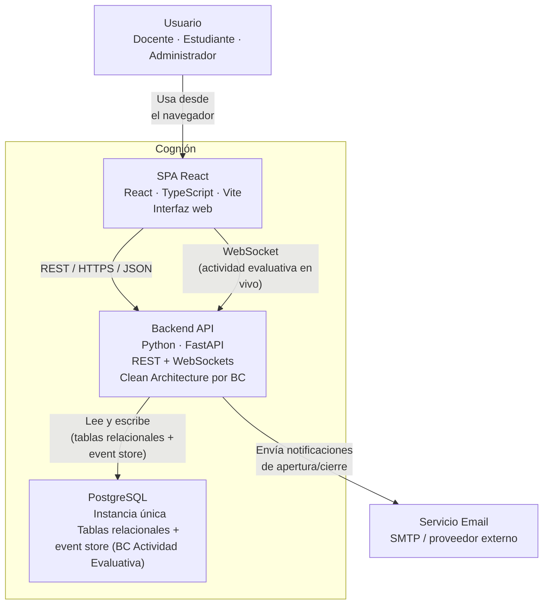

# 02 Container View

## Propósito

Describir la descomposición de Cognión en sus principales contenedores técnicos y las
relaciones entre ellos.

Esta vista muestra cómo el sistema deja de comportarse como una única caja negra y se organiza
en frontend, backend, persistencia e integraciones externas.

## Alcance

Incluye:

- contenedores principales de la solución;
- responsabilidades de cada contenedor;
- tecnologías asociadas a cada uno;
- relaciones de alto nivel entre frontend, backend, base de datos y servicio externo.

No incluye todavía la descomposición interna del backend en Bounded Contexts ni el detalle de
los flujos de runtime entre ellos.

## Fuentes

- `docs/adr/ADR-001-monolito-modular-clean-architecture.md`
- `docs/adr/ADR-002-event-sourcing-cqrs-sesiones.md`
- `docs/adr/ADR-003-fastapi-vs-django-channels.md`
- `docs/adr/ADR-004-postgresql-vs-sqlite.md`
- `docs/adr/ADR-005-websockets-sesiones-en-vivo.md`
- `docs/adr/ADR-015-renombrar-bc-sesiones-actividad-evaluativa.md`

## Descripción

Cognión se organiza como un monolito modular con dos contenedores de aplicación principales:

- una **SPA React** como interfaz de usuario;
- una **Backend API** en FastAPI que concentra la lógica de aplicación, expone REST y
  WebSockets, y organiza internamente los Bounded Contexts con Clean Architecture (ADR-001).

La persistencia es una **única instancia PostgreSQL** (ADR-004), compartida por todos los BCs.
El BC Actividad Evaluativa (antes "Sesiones", ver `ADR-015`) agrega, dentro de esa misma
instancia, una tabla append-only de eventos que funciona como event store (ADR-002) — no hay
una base de datos separada por BC ni por mecanismo de persistencia.

## Contenedores

### SPA React

Interfaz de usuario servida como aplicación de página única, construida con Vite. Atiende los
flujos de docente, estudiante y administrador, incluida la vista de proyección en aula durante
actividades evaluativas en vivo.

Consume la Backend API vía REST para operaciones síncronas, y vía WebSocket para la dinámica en
tiempo real de la actividad evaluativa en vivo (ranking, avance de preguntas).

**Tecnología principal:** `React` + `TypeScript` + `Vite` + `Tailwind CSS` + `shadcn/ui`

### Backend API

Aplicación backend que expone API REST y endpoints WebSocket, aplica Clean Architecture por
Bounded Context, y coordina la ejecución de Use Cases.

Actúa como composition root del sistema y concentra:

- validación de requests (Pydantic en la frontera);
- orquestación de comandos y queries por BC;
- acceso a persistencia compartida (PostgreSQL);
- integración con el servicio externo de email;
- broadcast en tiempo real durante actividades evaluativas en vivo.

**Tecnología principal:** `Python` + `FastAPI` + `SQLAlchemy async`

### PostgreSQL

Instancia única de PostgreSQL, compartida por todos los Bounded Contexts.

- Tablas relacionales convencionales para Identidad, Banco de Preguntas y Notificaciones.
- Tabla append-only `events` (JSONB) para el BC Actividad Evaluativa — event store + soporte de
  proyecciones de Analytics.

**Tecnología principal:** `PostgreSQL`

### Servicio Email

Servicio externo (SMTP) responsable del envío de notificaciones de apertura/cierre de
actividad evaluativa.

## Diagrama de contenedores

## Relaciones

| Relación | Descripción |
|----------|-------------|
| `Usuario -> SPA React` | El usuario interactúa con el sistema a través del navegador. |
| `SPA React -> Backend API (REST)` | El frontend consume la API REST para operaciones síncronas. |
| `SPA React -> Backend API (WebSocket)` | El frontend recibe actualizaciones en tiempo real durante la actividad evaluativa en vivo. |
| `Backend API -> PostgreSQL` | El backend persiste y consulta el estado de todos los BCs en la misma instancia. |
| `Backend API -> Servicio Email` | El backend delega el envío de notificaciones a un proveedor externo. |

## Restricciones relevantes en esta vista

- El frontend no accede directamente a la base de datos ni al servicio de email.
- Todos los Bounded Contexts comparten la misma instancia PostgreSQL — no hay bases de datos
  separadas por BC (a diferencia de un enfoque BC-first con persistencia aislada).
- El event store del BC Actividad Evaluativa convive con las tablas relacionales de los demás
  BCs en la misma instancia, pero como tabla propia — el aislamiento entre BCs es a nivel de
  código (Clean Architecture, puertos), no de infraestructura de datos.
- Las conexiones WebSocket persisten durante toda la actividad evaluativa en vivo.

## Decisiones arquitectónicas reflejadas

- `FastAPI` como backend principal (ADR-003).
- Monolito modular con Clean Architecture interna (ADR-001).
- `PostgreSQL` como única base de datos (ADR-004).
- `Event Sourcing` aplicado solo al BC Actividad Evaluativa (ADR-002).
- `WebSockets` para la actividad evaluativa en vivo (ADR-005).

## Implicancias para las siguientes vistas

Esta vista deja planteadas dos profundizaciones necesarias:

- cómo se organiza el backend internamente en Bounded Contexts (`03-bounded-contexts.md`,
  a completar en la Iteración 0 del Incremento 1 — BC Identidad, primer BC de dominio tras la
  revisión de `PLAN_v1.md` del 2026-07-15);
- cómo colaboran los BCs Actividad Evaluativa y Notificaciones en runtime sin romper sus
  fronteras (`20-context-map-integrations.md`, a completar cuando se modele Notificaciones en
  el Incremento 5).

## Siguiente paso

El siguiente documento de esta carpeta se crea recién en la Iteración 0 — Modelado del
Incremento 1 (BC Identidad), junto al event storming del primer BC — ver
`docs/rf/PLAN_v1.md`.
