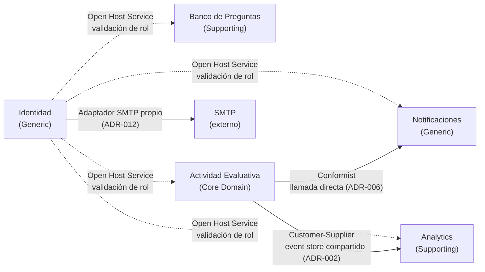

# 20 Context Map — Integraciones entre Bounded Contexts

## Propósito

Documentar cómo colaboran los Bounded Contexts de Cognión en runtime, usando los patrones de
relación de context mapping de DDD (Shared Kernel, Customer-Supplier, Conformist, Open Host
Service, Anticorruption Layer, etc.).

## Alcance — versión v0

Esta es una versión **incremental y deliberadamente incompleta**: solo documenta las relaciones
ya decididas o inevitables a partir de los ADRs existentes y de la regla de comunicación de
`03-bounded-contexts.md`. Las relaciones de BCs que todavía no se modelaron (Banco de Preguntas,
Actividad Evaluativa, Analytics, Notificaciones en detalle) quedan explícitamente **a definir**
— no se infieren ni se diseñan por anticipado, para evitar diseño especulativo antes de su
propia Iteración 0 (ver `docs/architecture/README.md` — "no todas de una vez").

## Fuentes

- `docs/adr/ADR-002-event-sourcing-cqrs-sesiones.md`
- `docs/adr/ADR-006-integracion-directa-sesiones-notificaciones.md`
- `docs/adr/ADR-012-politica-invitacion-link.md`
- `docs/adr/ADR-015-renombrar-bc-sesiones-actividad-evaluativa.md` — el BC "Sesiones" citado en
  los ADRs anteriores se llama, desde el 2026-07-16, **Actividad Evaluativa**.
- `docs/architecture/03-bounded-contexts.md`

## Relaciones documentadas

| BC origen | BC destino | Patrón | Mecanismo | Fuente |
|-----------|-----------|--------|-----------|--------|
| Identidad | Banco de Preguntas, Actividad Evaluativa, Analytics, Notificaciones | **Open Host Service** | Los cuatro BC validan rol/identidad a través de un puerto de Identidad (dependency injection de FastAPI) — ninguno implementa su propia autenticación. | `03-bounded-contexts.md`, `ADR-007` |
| Actividad Evaluativa | Notificaciones | **Conformist** (acoplamiento directo, deuda técnica consciente) | El Use Case de Actividad Evaluativa llama directamente al Use Case de Notificaciones al abrir/cerrar una actividad de período abierto. | `ADR-006` |
| Actividad Evaluativa | Analytics | **Customer-Supplier** vía event store compartido | Analytics proyecta read models leyendo directamente el event store (tabla `events`) de Actividad Evaluativa — sin pasar por un puerto de comandos, solo lectura. | `ADR-002` |
| Identidad | (servicio externo SMTP) | — | BC Identidad envía el email de invitación con su propio adaptador SMTP, independiente del Servicio Email que usará Notificaciones. | `ADR-012` |

## Relaciones pendientes de definir

Estas relaciones existen conceptualmente (el módulo de arquitectura de `ARQ_v1.md` las
insinúa) pero **no están modeladas todavía** — se definen recién en la Iteración 0 del
incremento que introduce el BC consumidor:

- **Banco de Preguntas → Actividad Evaluativa**: cómo Actividad Evaluativa selecciona
  `PreguntaPlantilla` al armar un set de preguntas para un estudiante (RF-11). *A definir en
  Incremento 3.*
- **Actividad Evaluativa → Identidad**: si el aggregate `ActividadEvaluativa` necesita algo más
  que el `Usuario` validado por el puerto de Identidad (ej. metadatos de comisión). *A definir
  en Incremento 3.*
- **Analytics → Banco de Preguntas**: si las métricas de desempeño por tema/unidad (RF-17)
  necesitan cruzar datos de Analytics con metadatos del Banco de Preguntas, o si esos metadatos
  ya viajan denormalizados en los eventos de Actividad Evaluativa. *A definir en Incremento 4.*
- **Identidad → Banco de Preguntas** (RF-03, gestión de cuentas): si la gestión de cuentas del
  administrador necesita datos de otros BC o es enteramente interna a Identidad. *A definir en
  Incremento 2, cuando se modele RF-03.*

## Diagrama (relaciones documentadas)

## Siguiente paso

Se actualiza esta vista cada vez que un nuevo incremento modela un BC y define sus relaciones
reales — no antes. La próxima actualización esperada es en el Incremento 2 (Banco de
Preguntas), al resolver su relación con Actividad Evaluativa y con la gestión de cuentas de
Identidad (RF-03).
