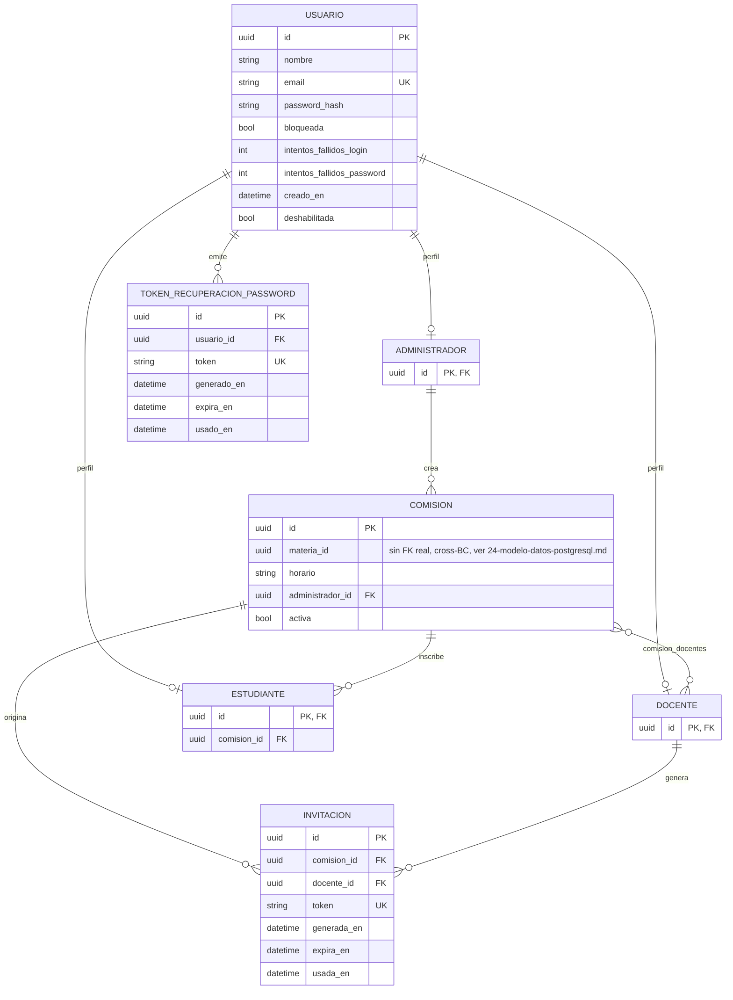

# Modelo de datos — BC Identidad

Ver principios generales y aislamiento cross-BC en `24-modelo-datos-postgresql.md`.

## Tablas

| Tabla | Rol |
|-------|-----|
| `usuario` | Base común de toda cuenta — email, hash de password, estado de bloqueo |
| `administrador` | Marca de perfil sobre `usuario` (tabla vacía salvo la FK/PK) |
| `docente` | Marca de perfil sobre `usuario` |
| `estudiante` | Marca de perfil sobre `usuario`, con su comisión asignada |
| `comision` | Comisión de una materia, con horario y docentes asignados |
| `comision_docentes` | Tabla puente N:M entre `comision` y `docente` |
| `invitacion` | Invitación emitida por un Docente para que un Estudiante se una a una Comisión |
| `token_recuperacion_password` | Token de un solo uso para recuperación de contraseña |

## Patrón "marca de perfil" (table-per-subclass manual)

`administrador`, `docente` y `estudiante` no son subclases de SQLAlchemy — son tablas
independientes cuya **PK es también FK a `usuario.id`**:

```python
class DocenteModel(Base):
    __tablename__ = "docente"
    id: Mapped[uuid.UUID] = mapped_column(PGUUID(as_uuid=True), ForeignKey("usuario.id"), primary_key=True)
```

Una fila en `docente` con `id = X` es un "marcador" de que el `usuario` `X` tiene perfil
Docente. `estudiante` extiende el patrón con una columna propia (`comision_id`), porque un
Estudiante necesita saber a qué Comisión pertenece (INV-ID-05: un Estudiante cursa una única
Comisión — sin muchos-a-muchos, limitación documentada en `CLAUDE.md` §Incremento 4).

## Diagrama ER



## Notas de implementación

- `comision.materia_id` **no tiene `ForeignKey`** en el modelo ORM — apunta a `materia` del BC
  Banco de Preguntas, resuelto vía `MateriaPort` (`US-2.1.2`). Es el único caso de FK "lógica"
  cross-BC de este BC.
- `usuario.email` es único — es el identificador de login.
- `invitacion.token` y `token_recuperacion_password.token` son únicos y de un solo uso
  (`usada_en`/`usado_en` marca el consumo).
- Contraseña segura (`INV-ID-11` ampliada, `US-ADJ-36`): mínimo 12 caracteres + mezcla de
  tipos, validada en dominio (`Usuario.validar_password_nueva()`), no en el esquema de BD.

## Fuente de verdad

`src/identidad/frameworks/db/models.py`.
