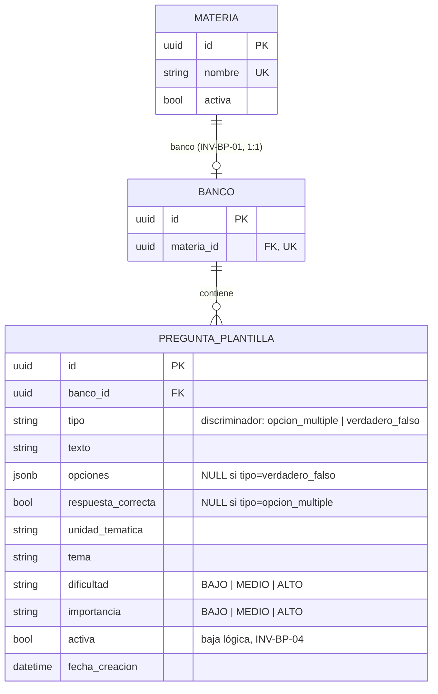

# Modelo de datos — BC Banco de Preguntas

Ver principios generales y aislamiento cross-BC en `24-modelo-datos-postgresql.md`.

## Tablas

| Tabla | Rol |
|-------|-----|
| `materia` | Materia dictada, dueña de a lo sumo un banco de preguntas |
| `banco` | Banco de preguntas de una Materia (INV-BP-01: relación 1:1) |
| `pregunta_plantilla` | Pregunta del banco, con `tipo` como columna discriminadora |

## Patrón "tipo discriminador" en `pregunta_plantilla`

Opción múltiple y Verdadero/Falso comparten la misma tabla en vez de tener una tabla por tipo.
La columna `tipo` distingue el caso, y cada tipo usa solo su columna relevante:

- Opción múltiple: `opciones` (JSONB) poblado, `respuesta_correcta` es `NULL`.
- Verdadero/Falso: `respuesta_correcta` (bool) poblado, `opciones` es `NULL`.

Este esquema no generaliza entre tipos de pregunta a propósito — es el mismo criterio que
`US-2.1.3`/`US-2.1.4` establecieron y que las US posteriores (`US-2.1.5` edición, `US-2.1.6`
baja lógica) repitieron sin abstraer, según lo previsto en el plan del Incremento 2.

## Diagrama ER

## Notas de implementación

- `materia.nombre` es único (INV-BP-00).
- `banco.materia_id` es único — sostiene INV-BP-01 (a lo sumo un banco por materia) a nivel de
  constraint de BD, no solo de invariante de dominio.
- `pregunta_plantilla.activa = false` es baja lógica (INV-BP-04, `US-2.1.6`) — el filtro
  `activa = true` es obligatorio en toda consulta de listado/filtrado (`FiltrarBancoUseCase`,
  `US-2.1.7`), salvo que se pida explícitamente lo contrario.
- `dificultad`/`importancia` son cadenas libres a nivel de columna (no un `ENUM` de Postgres);
  el conjunto cerrado de valores se valida en dominio, no en el esquema.
- `unidad_tematica`/`tema` son texto libre — sin catálogo ni tabla propia (decisión de
  `US-2.1.8`, ratificada en `US-ADJ-02` con `<datalist>` en el frontend, no en la BD).
- `fecha_creacion` se agregó después de la creación original de la tabla (ajuste `SP-ADJ-01`,
  `US-ADJ-03`) para sostener la paginación — ver `migrations/versions/` para el detalle del
  backfill.

## Fuente de verdad

`src/banco_preguntas/frameworks/db/models.py`.
