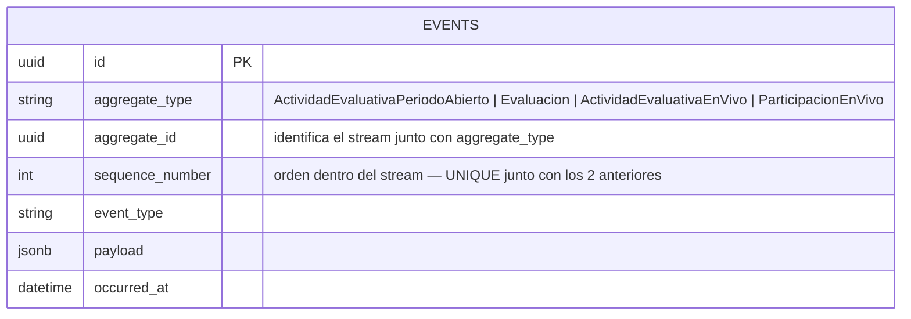
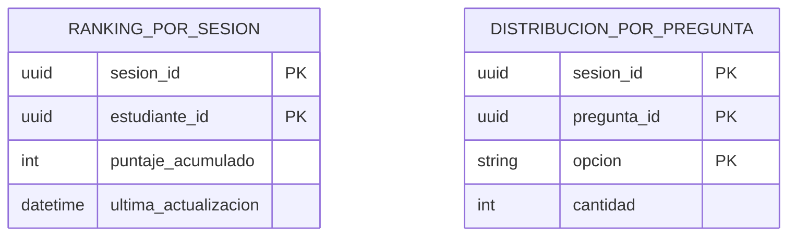

# Modelo de datos — BC Actividad Evaluativa (Event Sourcing + CQRS)

Ver principios generales y aislamiento cross-BC en `24-modelo-datos-postgresql.md`.

## No hay tablas por aggregate — hay una tabla `events`

A diferencia de Identidad y Banco de Preguntas, este BC no persiste el estado final de sus
aggregates (`ActividadEvaluativaPeriodoAbierto`, `Evaluacion`) como filas — persiste **la
secuencia de eventos de dominio que los produjo**. El estado se reconstruye en memoria
haciendo replay del stream completo (`Evaluacion.reconstruir()`,
`ActividadEvaluativaPeriodoAbierto.reconstruir()`), no se lee directo de una tabla.

Es el primer BC del sistema con Event Sourcing (`ADR-002`) y el primero con Unit of Work por
Use Case (`ADR-009`).

## Tabla `events`

| Columna | Rol |
|---------|-----|
| `id` | PK propia de la fila (no del aggregate) |
| `aggregate_type` | Nombre del aggregate — `ActividadEvaluativaPeriodoAbierto`, `Evaluacion`, `ActividadEvaluativaEnVivo` o `ParticipacionEnVivo` |
| `aggregate_id` | UUID del aggregate concreto (una Actividad, una Evaluación puntual) |
| `sequence_number` | Posición del evento dentro del stream de ese aggregate — arranca en 1 |
| `event_type` | Tipo de evento (`ActividadEvaluativaCreada`, `EvaluacionIniciada`, etc.) |
| `payload` | JSONB con los datos del evento |
| `occurred_at` | Timestamp de ocurrencia |

**Constraint clave:** `UNIQUE (aggregate_type, aggregate_id, sequence_number)`
(`uq_events_stream_sequence`). Sostiene dos cosas a la vez:

1. **Replay ordenado** — el stream de un aggregate se lee ordenando por `sequence_number`.
2. **Concurrencia optimista** — un segundo `append` con el mismo `sequence_number` para el
   mismo stream viola la constraint en la base antes de que `SQLAlchemyEventStore` necesite
   compararlo en memoria.

Desde el Incremento 6 (Sesión en Vivo), la misma tabla `events` también guarda los streams de
los dos aggregates del modo en vivo (`ActividadEvaluativaEnVivo`, `ParticipacionEnVivo`) —
agregados hermanos de `ActividadEvaluativaPeriodoAbierto`/`Evaluacion` dentro del mismo BC,
sin tabla propia ni esquema distinto (`ADR-015`).

## Streams por aggregate y sus eventos (a la fecha)

### `ActividadEvaluativaPeriodoAbierto`

| # | Evento | Origen |
|---|--------|--------|
| 1 | `ActividadEvaluativaCreada` | `US-3.1.2` |
| 2 (opcional) | `PeriodoDisponibilidadModificado` | `US-3.3.1` |
| 3 (opcional) | `ActividadEvaluativaCerrada` | `US-3.3.2` |
| 4 (opcional) | `TituloActividadModificado` | `US-ADJ-10` |

### `Evaluacion`

| # | Evento | Origen |
|---|--------|--------|
| 1 | `EvaluacionIniciada` | `US-3.1.3` |
| N (repetible) | `RespuestaRegistrada` | `US-3.2.1` |
| — | `EvaluacionSuspendida` | `US-3.2.2` |
| — | `EvaluacionReanudada` | `US-3.2.2` |
| — | `EvaluacionFinalizada` | `US-3.2.3` |

### `ActividadEvaluativaEnVivo`

| # | Evento | Origen |
|---|--------|--------|
| 1 | `SesionEnVivoCreada` | `US-6.1.2` |
| 2 | `SesionEnVivoIniciada` | `US-6.1.4` |
| N (repetible) | `OpcionesEnVivoMostradas` | `US-6.2.2` |
| N (repetible) | `PreguntaEnVivoCerrada` | `US-6.2.5` |
| N (repetible) | `SiguientePreguntaPresentada` | `US-6.2.6` |
| — (terminal, alternativo) | `SesionEnVivoFinalizada` | `US-6.2.7` |
| — (terminal, alternativo, solo desde `EnEspera`) | `SesionEnVivoCancelada` | `US-ADJ-58` |

### `ParticipacionEnVivo`

| # | Evento | Origen |
|---|--------|--------|
| 1 | `EstudianteUnido` | `US-6.1.3` |
| N (repetible) | `RespuestaEnVivoRegistrada` | `US-6.2.4` |

Stream con `aggregate_id` determinístico (`uuid5(sesion_id:estudiante_id)`) — no un UUID
random como los demás aggregates, para que una reconexión o una unión repetida resuelva
siempre al mismo stream sin necesidad de consultarlo primero (`US-6.1.3`).

`_aplicar_evento` en cada aggregate hace dispatch por `event_type` durante el replay — no
asume que el primer evento es siempre el mismo tipo ni que el resto sigue un orden fijo
(corrección introducida en `US-3.2.2`, generalizada a `ActividadEvaluativaPeriodoAbierto` en
`US-3.3.1`, y aplicada desde el inicio a los dos streams del modo en vivo).

## Diagrama (forma de log, no ER tradicional)

No hay relaciones declaradas en el esquema entre distintos `aggregate_id` — cualquier relación
(ej. "las Evaluaciones de una Actividad") se resuelve leyendo `payload` (`EvaluacionIniciada`
incluye `actividad_id` en su payload), nunca por FK.

## Read models sobre la misma tabla

`EvaluacionActivaQueryPort` (`US-3.2.4`) y las consultas de Analytics
(`EvaluacionDesempenoConsultaPort`, `SesionEnVivoDesempenoConsultaPort` — `US-ADJ-56`) leen
esta misma tabla `events` como fuente — no hay proyección materializada aparte. Decisión
confirmada con Víctor: válida a esta escala (30-60 alumnos), documentada como reversible si
el volumen cambia (`CLAUDE.md`, notas de `US-3.2.4`).

## Dos tablas de read model materializado — modo en vivo (`US-6.2.3`)

A diferencia de lo anterior, el modo en vivo sí tiene dos tablas propias, materializadas y
actualizadas por `UPDATE` atómico (`ON CONFLICT DO UPDATE`) en el mismo Use Case que hace el
`append` del evento — no queries de lectura sobre `events`. Motivo: el ranking y el
histograma se necesitan en **tiempo real**, para el broadcast por WebSocket al cerrar cada
pregunta, y recalcularlos desde cero replayando el stream completo en cada cierre no escala
con la cadencia de una sesión en vivo.

| Tabla | Rol | PK |
|-------|-----|-----|
| `ranking_por_sesion` | Puntaje acumulado por participante | `(sesion_id, estudiante_id)` |
| `distribucion_por_pregunta` | Cantidad de respuestas por opción, para el histograma | `(sesion_id, pregunta_id, opcion)` |

**Contrato de atomicidad:** la proyección se escribe (sin `commit` propio) antes del
`append` del evento en la misma transacción — el `commit` del `append` confirma ambas
escrituras juntas. Si el `append` pierde la carrera de concurrencia optimista, el Use Case
descarta lo pendiente (`descartar_pendientes()`) sin tocar `SQLAlchemyEventStore`. Verificado
contra 60 respuestas simultáneas sin perder ninguna (`US-6.2.3`, `US-6.2.9`).

## Fuente de verdad

`src/actividad_evaluativa/frameworks/db/models.py`,
`docs/design/domain/BC-actividad-evaluativa-modelo.md` §6 (modelado del event store).
