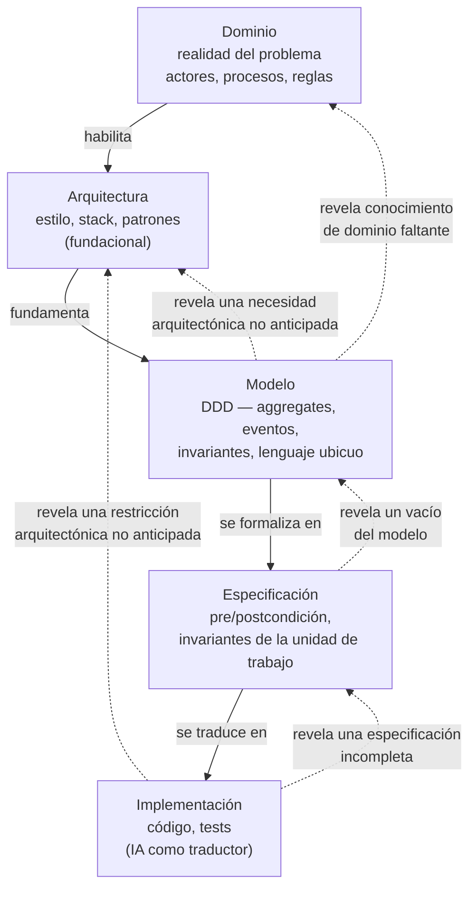

# Diagrama Conceptual: Ciclo de Refinamiento IEDD

Este documento presenta el marco conceptual como un **ciclo de refinamiento**, no como una
cadena unidireccional. La versión anterior de este diagrama (`Dominio → Modelo →
Especificación → Arquitectura → Implementación`, en línea recta) describía bien el primer
descenso sobre un dominio nuevo, pero no tenía vocabulario para los retornos legítimos que la
evidencia de AtaraxiaDive y Cognión muestran una y otra vez: una decisión de arquitectura que
surge recién al implementar, un modelo que se corrige durante la especificación, un RF que se
descubre faltante mientras se modela. Este documento reemplaza esa cadena por el ciclo que
efectivamente se observó.

---

## Diagrama conceptual

Flechas llenas: el **primer descenso** — el recorrido por defecto la primera vez que un
Bounded Context nuevo entra al ciclo. Flechas punteadas: **retornos legítimos** — no describen
casos puntuales, describen el *tipo* de relación: qué significa, conceptualmente, que una capa
posterior obligue a revisar una anterior. Evidencia empírica de que estas relaciones ocurren
en la práctica: `docs/iedd/04-Hipotesis_Ensayo_IA_Ingenieria_Human_In_The_Loop.md` y la sección
"Por qué el ciclo, y no la cadena" más abajo. El diagrama no es exhaustivo de todos los pares
posibles — cualquier capa puede, en principio, revelar una necesidad no resuelta en cualquier
capa anterior; se representan los pares con relación conceptual más directa.

---

## La regla de reingreso

Un retorno (flecha punteada) es distinto de deriva documental (`HITO-27`) o de
spec-validatoria (`HITO-29`) en un solo punto:

> **Todo retorno reingresa por el mismo gate que la primera vez** — se actualiza el artefacto
> de la capa a la que se vuelve y se re-aprueba explícitamente, antes de volver a descender.

Ejemplo aplicado: si al implementar `US-1.1.5` (RBAC) se descubre que la matriz rol→recurso
necesita un concepto que el modelo de dominio no contemplaba, el camino correcto no es ajustar
el código y seguir — es volver a `docs/design/domain/BC-identidad-modelo.md`, actualizarlo,
conseguir la aprobación de Víctor de nuevo, y recién entonces bajar otra vez por
Especificación hacia Implementación. El ciclo tolera el retorno; no tolera saltearse el gate.

---

## Interpretación de cada nodo

### 1. Dominio

Representa la realidad que el sistema intenta modelar: actores, procesos, reglas de negocio y
restricciones del mundo real. Sin decisión tecnológica todavía.

### 2. Arquitectura (fundacional)

El primer descenso pasa por Arquitectura **antes** que por Modelo, no después: el estilo
arquitectónico, el stack y los patrones de organización (`ARQ_v1.md`, Clean Architecture,
Event Store, etc.) son condición de posibilidad del modelado — no se puede hacer event
storming en serio sin saber si hay Event Sourcing o CRUD, sync o async. Esta arquitectura
fundacional se decide una vez por proyecto (`docs/iedd/05-Fases-y-Gates.md` §3.1).

Los retornos a Arquitectura son decisiones puntuales que emergen después de la primera visita
— y pueden originarse tanto en Modelo (`M -.-> A`: el modelado revela que el dominio necesita
algo que la arquitectura fundacional no contempló — ej. un patrón de consistencia entre
aggregates, un mecanismo de comunicación entre BCs) como en Implementación (`I -.-> A`: un
driver arquitectónico que solo se revela al construir o al operar en producción). Ninguno de
los dos reemplaza a la arquitectura fundacional — la extienden.

### 3. Modelo

Representación conceptual del dominio: entidades, objetos de valor, agregados, eventos,
contextos delimitados, lenguaje ubicuo (DDD). Captura reglas del dominio, invariantes y
comportamiento esperado. Se apoya en la arquitectura fundacional ya decidida, sin que la
arquitectura le dicte los conceptos del dominio — la diferencia entre "arquitectura habilita
el modelo" y "arquitectura decide el modelo" es la que separa esta secuencia de un
anti-patrón tech-first.

### 4. Especificación

Describe **qué** debe hacer el sistema — operaciones, precondiciones, postcondiciones,
invariantes, eventos — sin referirse a tecnología. Es la capa donde el modelo y la
arquitectura fundacional convergen en un contrato de comportamiento verificable.

### 5. Implementación

Materializa el sistema en código, APIs, bases de datos, infraestructura. Con IA generativa,
esta capa puede derivarse en buena parte de la especificación — la IA funciona como traductor
conceptual, con calidad proporcional a la claridad del modelo y la precisión de la spec
(`docs/iedd/01-...md` §5).

---

## Por qué el ciclo, y no la cadena

Tres hallazgos de `docs/iedd/04-Hipotesis_Ensayo_IA_Ingenieria_Human_In_The_Loop.md` muestran
que el flujo real nunca fue una línea recta:

- **`HITO-11`** — un quality gate (artefacto de Implementación) catalizó una decisión
  arquitectónica documentada como ADR. El ciclo entró por Implementación y volvió a
  Arquitectura.
- **`HITO-26`** — cobertura asimétrica de event storming (solo un BC modelado a fondo) se
  detectó como deuda recién en incrementos posteriores. El ciclo entró por Especificación/
  Implementación y forzó volver a Modelo.
- **`HITO-20`** — invariantes correctos pero incompletos ante variantes no anticipadas del
  dominio; el UAT fue el único oráculo que lo detectó. El ciclo entró por Implementación y
  volvió a Especificación.

Una cadena lineal no tiene forma de representar estos tres casos sin tratarlos como
excepciones al modelo. Un ciclo con regla de reingreso los representa como parte normal del
proceso — la disciplina no está en evitar el retorno, está en no saltearse el gate al volver.

El mismo patrón generaliza al par Modelo → Arquitectura, aunque no haya todavía un HITO
puntual que lo documente: si el modelado de un BC revela una necesidad estructural que la
arquitectura fundacional no previó (por ejemplo, un patrón de comunicación entre Bounded
Contexts que antes no existía), el ciclo debe volver a Arquitectura y re-ratificar esa
decisión — no forzar el modelo a caber en una arquitectura que ya no lo sostiene.

---

## Idea central

La ingeniería de software es la disciplina que transforma conocimiento del dominio en
comportamiento ejecutable mediante modelos y especificaciones — y que **refina esa
transformación en ciclos**, no en una sola pasada. Los lenguajes de programación son
tecnología de implementación; el núcleo de la disciplina es el modelado, la especificación
precisa y el gobierno explícito de cuándo y cómo se vuelve atrás.
